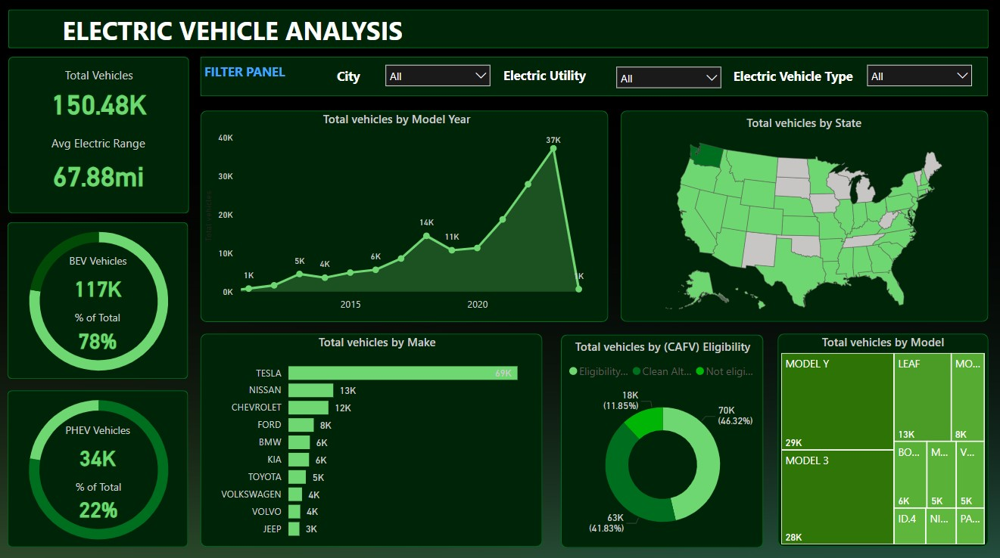

# Electric-vehicle-sales-data-analysis
This project demonstrates the creation of a comprehensive Sales Data Analysis Dashboard using Microsoft Power BI. The goal is to provide a clear and insightful visualization of sales performance across various dimensions such as time, products, and regions. The project includes data cleaning, transformation, and visualization techniques.

# Sales Dashboard

This repository contains the Power BI sales dashboard and associated datasets.

# Overview

The dashboard provides insights into sales performance, including key metrics such as total sales, average order value, and sales trends over time.

# Files

- `Electric Vehicle Dashboard.pbix`: The Power BI report file.
- `Electric_Vehicle_Population_Data.csv`: The dataset used for the dashboard.

# How to Use

1. Download the `.csv` file for icons.
2. Use those in Power BI Desktop.
3. Connect to the `Electric_Vehicle_Population_Data.csv`
4. See the image attached for dashboard reference.

